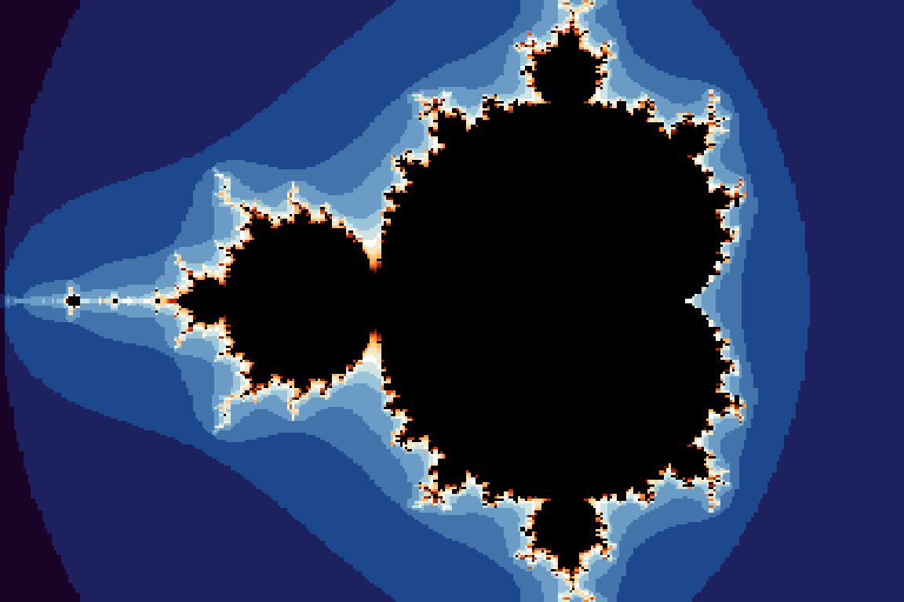
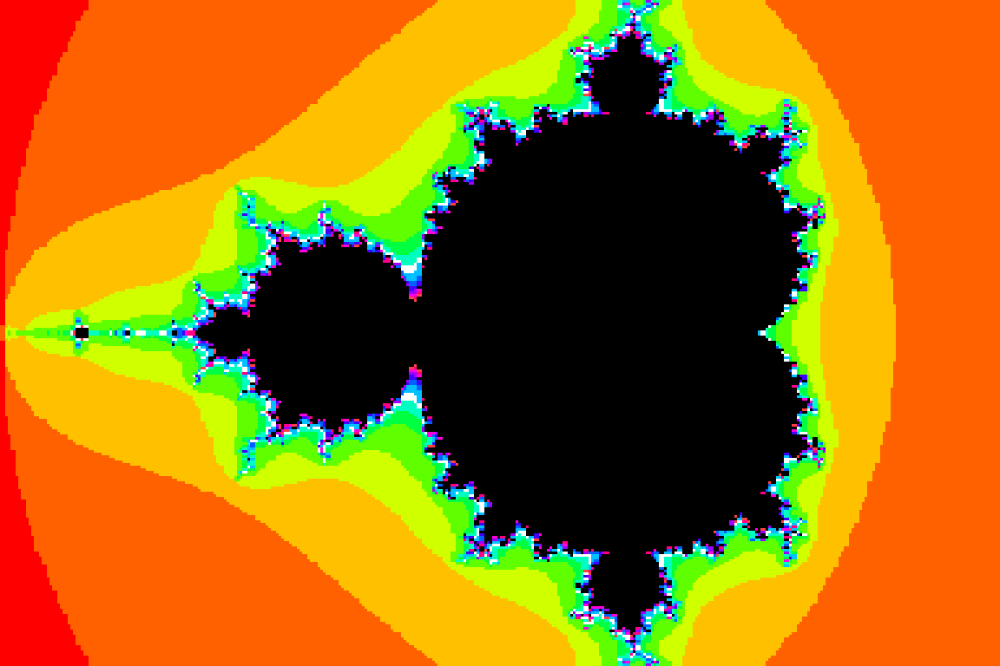
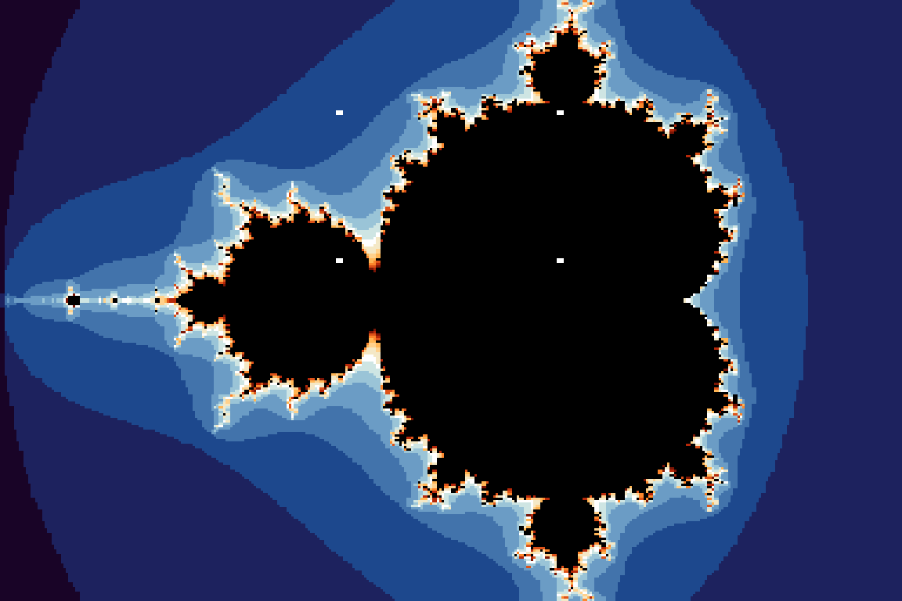
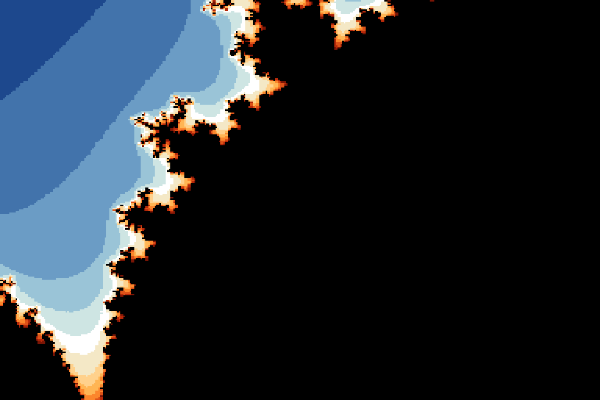

# Mandelbrot Upic

| 64 MHz (Elite II, C64 Ultimate) | 48 MHz (U64, Elite; 3 of 4 pixels) |
|---|---|
|  |  |

An Ultimate 64 demo that generates a Mandelbrot fractal
on-device at 64 MHz turbo, packs it directly into Upic format (a
16-color, 384x256 border-color raster picture technique), displays it
live as it renders, and lets you interactively pan around and zoom
into any region of the result.

Every pixel is exactly one dot wide and the picture fills the whole
384-dot visible area. The same PRG also runs on an original Ultimate 64
or Ultimate 64 Elite (48 MHz turbo maximum): it measures the CPU speed at
startup and, on a 48 MHz machine, shows 288 of the 384 pixels per line
(3 of every 4) on the same dots, at the same size and position. Both are
checked on real hardware with an automated end-to-end test (`make e2e`,
see [Make targets](#make-targets)).

Press F1 to save the current picture as a `.upic` file (Upic v1.3
format, with its palette), for example to view it in other Upic tools.

See `CREDITS.md` for full attribution.

**Status**: v1.2.0, feature-complete and confirmed working on real
hardware: an Ultimate 64 Elite II (64 MHz path) and an Ultimate 64
Elite (48 MHz path), both on firmware 3.15a.

**[Watch it in action](https://www.youtube.com/watch?v=0inIaiqH8s0)**
-- v1.2.0 on real hardware, captured from the video stream: the three
live views, all 4 palettes, zooming to the maximum and saving. The
v1.0 video is [here](https://www.youtube.com/watch?v=fWSM7ikNegw).

## Contents

- [Controls](#controls)
  - [Live view](#live-view)
  - [Saving pictures](#saving-pictures)
- [Installation](#installation)
- [Building from source](#building-from-source)
- [Documentation](#documentation)
- [Changelog](CHANGELOG.md)
- [Credits](CREDITS.md)

## Controls

Generation starts automatically on launch and the picture builds up
live, left to right. Once it completes, you're in **browse mode**:

| Input | Action |
|---|---|
| `W`/`A`/`S`/`D` | Pan the current view (no-op at the default overview -- nothing to pan to) |
| Cursor keys (hold Shift for up/left) | Same, alternative for muscle memory |
| `Z` | Enter box mode to pick a zoom target |
| `O` | Zoom out one notch (widens the view, clamped to the original overview) |
| `C` | Cycle the base color gradient (sunset, fire, amethyst, rainbow) |
| `F1` | Save the picture as `MANDELnn.UPIC` (see [Saving pictures](#saving-pictures)) |
| `V` | Cycle the live view used while a picture is computed: bar, classic, full (see [Live view](#live-view)) |

Panning regenerates the fractal at the same zoom level, shifted --
each step is a fraction of the current view's own size, so it moves
less in absolute terms the deeper you've zoomed in.

The 4 selectable gradients:

| 64 MHz (Elite II, C64 Ultimate) | 48 MHz (U64, Elite; 3 of 4 pixels) |
|---|---|
|  |  |
|  |  |
|  |  |

Press `Z` to enter **box mode**: 4 corner markers (solid white 2x2
blocks) appear, outlining a box that always keeps the picture's own
3:2 aspect ratio:

| 64 MHz (Elite II, C64 Ultimate) | 48 MHz (U64, Elite; 3 of 4 pixels) |
|---|---|
|  |  |

| Input | Action |
|---|---|
| `W`/`A`/`S`/`D` | Move the whole box |
| Cursor keys (hold Shift for up/left) | Same, alternative for muscle memory |
| `+` | Grow the box (aspect ratio unchanged) |
| `-` | Shrink the box (aspect ratio unchanged) |
| `RETURN` | Confirm and zoom into the box |
| `Z` | Cancel back to browse mode without zooming |
| `C` / `O` / `F1` / `V` | Same as browse mode (F1 saves without the markers) |

Confirming regenerates the fractal at the selected region and returns
to browse mode. Repeated zooms compose relative to whatever's
currently displayed, so zooming, panning, and zooming again all work
together.

| 64 MHz (Elite II, C64 Ultimate) | 48 MHz (U64, Elite; 3 of 4 pixels) |
|---|---|
|  |  |

**Zoom precision limit**: the fractal coordinates use a fixed-point
format with a finite number of fractional bits, capping how far
repeated zooming can go (roughly 16x total from the initial view)
before individual pixel steps round down to zero and the picture stops
changing with further zoom. This is a hard limit of the current
implementation, not a bug -- see `docs/MANDELBROT_ALGORITHM.md`.

**No quit key** -- reset or power off to exit, same as many C64 demos
with no graceful exit path. See `docs/ZOOM_FEATURE.md` for why.

### Live view

While a picture is computed you see one of three live views; `V` cycles
through them, also while the picture is being computed:

| View | What you see | First picture, Elite II |
|---|---|---|
| Bar (default) | An 8-line band through the middle of the picture fills from left to right as a progress bar, with a white cursor at its front edge, then rolls open to the whole picture | 6.9 s |
| Classic | The picture builds up in full, flickering (the live view of v1.0-v1.1) | 11.2 s |
| Full | The picture builds up in full and steady, without flicker | 38.8 s: showing it takes most of the CPU |

Bar and Full show the picture from a raster interrupt (Aleksi Eeben's
idea and viewer); Classic draws a frame between columns.

### Saving pictures

`F1` saves the picture shown -- without the zoom box markers -- as
`MANDEL01.UPIC`, `MANDEL02.UPIC`, ... (the first free number). The screen
stays black for a moment while the file is written; if saving fails the
picture blinks three times. Files go to the Ultimate's current directory,
or its home directory when the current one can't take files (after a
reset that can be the virtual root `/`).

The file is a Upic v1.3 picture: a 256-byte header (with the active
gradient's palette and three text lines: the program version, the view
coordinates and "Created with Xander's Mandelbrot Upic") followed by the
49152-byte bitmap. Aleksi Eeben's Upic
tools use this format; the bitmap part is the same as the `.upic` files
of his Upic Image Converter.

## Installation

Requires **firmware 3.15 or newer** on an **Ultimate 64**, **Ultimate
64 Elite** or **Ultimate 64 Elite II**. The Elite II runs at 64 MHz and
shows the full picture; the original Ultimate 64 and the Elite top out
at 48 MHz and use the 48 MHz display path described above. The
Commodore 64 Ultimate (C64U), built on the Elite II design with its own
firmware branch, needs the C64U firmware release that adds palette
control (expected to be 1.2, not yet released at the time of writing);
the same PRG already ran on a 1.2 release candidate during the 48 MHz
work's testing.

1. Copy both `mandelupic.prg` and `mandelupic.cfg` onto your Ultimate's
   SD card or USB storage, in the same folder -- extracting the
   release ZIP already places them together (at
   `idi8b/mandelupic/`), or `make deploy`/`make zip` produce them from
   source with matching names.
2. Run `mandelupic.prg` from the Ultimate's file browser.

The Ultimate's own firmware auto-loads a config file that shares its
base name with the program being run -- `mandelupic.cfg` next to
`mandelupic.prg` is picked up automatically, no manual "load config"
step needed. It enables the Command Interface (UCI) and the turbo
registers this demo needs; if your own configuration already has both
enabled, this has no effect either way.

The same `mandelupic.cfg` works on every supported machine, so there is
nothing to choose or rename. The turbo setting has a different value
name per product (`U64 Turbo Registers` on an Ultimate 64,
`C64U Turbo Registers` on a C64 Ultimate), so the file contains both
lines: the firmware skips the value it doesn't know and applies the one
it does, silently when the file is auto-loaded. (Loading the file by
hand from the menu shows a brief message about the skipped line; that
is expected and harmless.) If the demo still doesn't run at turbo
speed, set `Turbo Control` to your machine's "... Turbo Registers"
value in the Ultimate menu.

## Building from source

### Prerequisites

| Tool | Purpose | Install |
|---|---|---|
| [Oscar64](https://github.com/drmortalwombat/oscar64) | C cross-compiler targeting 6502/C64 | build from source, see their README |
| `wput` | FTP deploy to the Ultimate device | `sudo apt install wput` |
| `pandoc` + `texlive-xetex` | Generate `README.pdf` (optional) | `sudo apt install pandoc texlive-xetex` |
| Python 3 | `make test`, `make e2e` (optional) | usually preinstalled |

### Getting the source

The Ultimate libraries are a git submodule, so clone with
`--recursive`:

```
git clone --recursive https://github.com/xahmol/mandelbrot-upic.git
```

or, after a plain clone, run `git submodule update --init`.

### Deploy setup

Copy `.env.example` to `.env` and set `ULTIP1` to your Ultimate
device's IP address (and, for `make e2e`, `E2E_DEVICES` to the devices
to test on):
```
cp .env.example .env
```

### Make targets

| Target | Effect |
|---|---|
| `make` / `make all` | Compile to `build/mandelupic.prg`, regenerate `README.pdf`, build the release ZIP |
| `make deploy` | FTP the compiled `.prg` and matching `.cfg` to the Ultimate device set in `.env` |
| `make test` | Build both PRGs and run the host-side tests in `tests/` (Python 3, standard library only) |
| `make force48` | Build the test-only `build/mandelupic-force48.prg`, which always uses the 48 MHz display path (at 48 MHz), so that path can be checked on an Elite II / C64U |
| `make deploy-force48` | FTP the force48 PRG (as `mandelupic-force48.prg`, with its own copy of the `.cfg`) next to the release one |
| `make e2e` | Run the release PRG on the real devices listed in `E2E_DEVICES` in `.env`, drive it with key presses over the REST API, and compare the VIC video stream with the golden images in `tests/e2e/golden/` (see `tests/e2e/README.md`) |
| `make e2e-update` | Same run, but write the captures as the new golden images for each device's display path |
| `make docs` | Regenerate `README.pdf` via pandoc |
| `make clean` | Remove build outputs |

## Documentation

| Document | Covers |
|---|---|
| [`docs/ARCHITECTURE.md`](docs/ARCHITECTURE.md) | Program flow, components, memory layout overview |
| [`docs/MANDELBROT_ALGORITHM.md`](docs/MANDELBROT_ALGORITHM.md) | Fixed-point fractal generation algorithm |
| [`docs/UPIC_VIEWER.md`](docs/UPIC_VIEWER.md) | The Upic border-color raster display technique |
| [`docs/ZOOM_FEATURE.md`](docs/ZOOM_FEATURE.md) | Interactive pan/zoom/palette control scheme |
| [`lib/ultimate-uci-oscar64`](https://github.com/xahmol/ultimate-uci-oscar64) | The Ultimate libraries (UCI protocol, U64 CPU speed control, the Upic display and `.upic` files), included as a git submodule; manuals in its `docs/` (`UPIC_MANUAL.md` for the display) |
| [`docs/OSCAR64_MANUAL.md`](docs/OSCAR64_MANUAL.md) | Oscar64 compiler reference (copy of the maintainer's canonical manual) |
| [`tests/README.md`](tests/README.md) / [`tests/e2e/README.md`](tests/e2e/README.md) | Host-side timing tests and the end-to-end test on real hardware |
| [`CHANGELOG.md`](CHANGELOG.md) | Version history |
| [`CREDITS.md`](CREDITS.md) | Full attribution |
